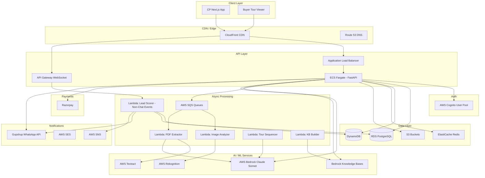
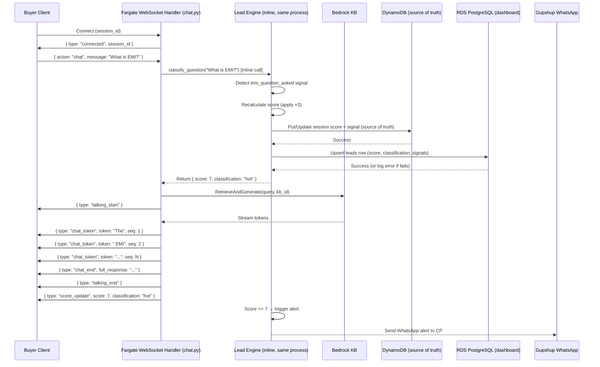
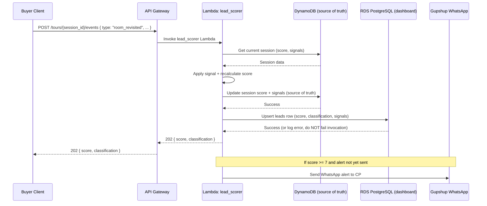
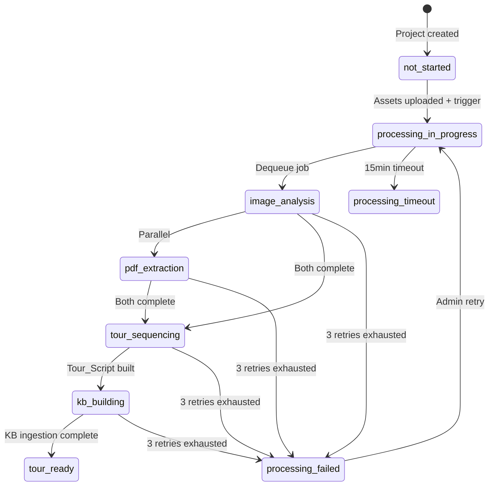

# Design Document: AutoMind AI Platform

## Overview

AutoMind AI Platform is a multi-tenant SaaS platform enabling real estate Channel Partners (CPs) to generate AI-powered virtual tours, share them via WhatsApp, and receive real-time hot-lead alerts based on buyer engagement scoring. The system features "Priya" — an SVG-rendered AI sales avatar powered by RAG (Retrieval-Augmented Generation) using AWS Bedrock Knowledge Bases.

### Key Design Decisions

1. **Serverless-first compute model**: Lambda workers for async processing, ECS Fargate for the FastAPI API server — balances cost and latency.
2. **DynamoDB for sessions/scores**: Sub-millisecond reads for real-time scoring; TTL auto-expiry for session cleanup.
3. **RDS Postgres for relational data**: Projects, CPs, partnerships, subscriptions — strongly consistent, ACID transactions.
4. **WebSocket via API Gateway**: Real-time chat streaming and dashboard updates without polling.
5. **SQS-driven pipeline**: Decoupled async processing with retry and dead-letter queue support.
6. **Single Knowledge Base per project**: Isolation of RAG context per builder project for accurate responses.

## Architecture

### High-Level System Architecture



### Request Flow Summary

1. **CP Login**: CP App → CloudFront → ALB → FastAPI → Cognito (OTP)
2. **Tour Viewing**: Buyer App → CloudFront → ALB → FastAPI (session creation) → WebSocket (chat/scoring)
3. **Chat + Inline Scoring (MVP)**: Buyer → WebSocket (Fargate) → classify_question() inline → Lead Engine inline (DynamoDB write → RDS write) → score_update via WebSocket — all synchronous within one Fargate process
4. **Non-Chat Lead Scoring**: Tour event POST → API Gateway → lead_scorer Lambda → DynamoDB write (source of truth) → synchronous RDS write (materialized for dashboard) → threshold check → alert
5. **Asset Processing**: S3 upload → SQS → Lambda pipeline → Tour_Script → KB ingestion

## Components and Interfaces

### Component Breakdown

| Component | Technology | Responsibility |
|-----------|-----------|----------------|
| CP Frontend | Next.js 14 (App Router) | Dashboard, project selection, share link UI |
| Buyer Frontend | Next.js 14 (App Router) | Tour viewer, chat, avatar rendering |
| API Server | FastAPI on ECS Fargate | REST endpoints, WebSocket management |
| Auth Service | AWS Cognito + FastAPI middleware | OTP, sessions, token validation |
| Lead Engine | Inline (Fargate) for chat events; Lambda for non-chat events + DynamoDB + RDS | Score calculation, dual-write (DynamoDB source of truth + RDS materialized view), threshold alerts |
| Tour Generator | Lambda pipeline (4 workers) | Asset → Tour_Script transformation |
| Notification Service | Gupshup + SNS + SES | WhatsApp alerts, SMS fallback, email |
| Billing Service | FastAPI + Razorpay SDK | Subscription management, webhooks |
| Admin Service | FastAPI endpoints | Builder/CP management, asset uploads |

### API Contracts

#### Auth Endpoints

```
POST /api/v1/auth/otp/request
  Body: { "phone": "9876543210" }
  Response 200: { "message": "OTP sent", "expires_in": 300 }
  Response 429: { "error": "rate_limited", "retry_after": 900 }

POST /api/v1/auth/otp/verify
  Body: { "phone": "9876543210", "otp": "123456" }
  Response 200: { "token": "jwt...", "expires_in": 86400, "is_new_user": true }
  Response 401: { "error": "invalid_otp", "attempts_remaining": 2 }
  Response 423: { "error": "locked", "unlock_at": "2024-01-01T12:15:00Z" }

POST /api/v1/auth/register
  Headers: Authorization: Bearer <token>
  Body: { "name": "Raj Kumar", "rera_id": "RERA/MH/2024/12345" }
  Response 201: { "cp_id": "uuid", "name": "Raj Kumar", "rera_id": "..." }
  Response 422: { "error": "invalid_rera_format", "expected": "RERA/{state}/{year}/{number}" }

POST /api/v1/auth/session/anonymous
  Body: { "link_id": "uuid" }
  Response 200: { "session_id": "uuid", "session_token": "jwt..." }
```

#### Dashboard Endpoints

```
GET /api/v1/dashboard/stats
  Headers: Authorization: Bearer <token>
  Response 200: {
    "month": "2024-01",
    "tours_shared": 45,
    "leads_generated": 128,
    "hot_leads": 12,
    "conversions": 3
  }

GET /api/v1/dashboard/hot-leads?limit=50&offset=0
  Headers: Authorization: Bearer <token>
  Response 200: {
    "leads": [
      {
        "lead_id": "uuid",
        "buyer_name": "Anonymous Buyer",
        "buyer_phone": null,
        "project_name": "Sunshine Heights",
        "score": 9,
        "classification": "hot",
        "signals": [
          { "type": "time_on_tour_3min_plus", "points": 2 },
          { "type": "price_question_asked", "points": 2 },
          { "type": "emi_question_asked", "points": 3 },
          { "type": "room_revisited", "points": 2 }
        ],
        "created_at": "2024-01-15T10:30:00Z"
      }
    ],
    "total": 12
  }

GET /api/v1/dashboard/leads/{lead_id}
  Headers: Authorization: Bearer <token>
  Response 200: {
    "lead_id": "uuid",
    "buyer_name": "Priya Sharma",
    "buyer_phone": "9876543210",
    "project_name": "Sunshine Heights",
    "score": 8,
    "classification": "hot",
    "signals": [...],
    "events": [
      { "type": "session_start", "timestamp": "2024-01-15T10:30:00Z", "data": {} },
      { "type": "room_viewed", "timestamp": "2024-01-15T10:31:00Z", "data": { "room": "living_room" } },
      { "type": "chat_message", "timestamp": "2024-01-15T10:33:00Z", "data": { "query": "What is the price?" } }
    ]
  }
```

#### Project Endpoints

```
GET /api/v1/projects
  Headers: Authorization: Bearer <token>
  Response 200: {
    "projects": [
      {
        "project_id": "uuid",
        "name": "Sunshine Heights",
        "builder_name": "ABC Builders",
        "location": "Pune, Maharashtra",
        "unit_types": ["2BHK", "3BHK"],
        "tour_status": "tour_ready"
      }
    ]
  }

POST /api/v1/projects/{project_id}/share-link
  Headers: Authorization: Bearer <token>
  Response 201: {
    "link_id": "uuid",
    "url": "https://tour.automind.ai/t/{link_id}",
    "og_card": {
      "title": "Sunshine Heights Virtual Tour",
      "description": "Experience Sunshine Heights with AI guide Priya",
      "image_url": "https://cdn.automind.ai/og/{project_id}.jpg"
    },
    "whatsapp_message": "🏠 Explore Sunshine Heights with our AI tour guide!\n{url}"
  }
```

#### Tour Endpoints

```
GET /api/v1/tours/{link_id}
  Response 200: {
    "tour_script": { ... },
    "session_id": "uuid",
    "websocket_url": "wss://ws.automind.ai/tour/{session_id}"
  }

POST /api/v1/tours/{session_id}/events
  Body: {
    "type": "room_viewed",
    "data": { "room_index": 2, "duration_seconds": 45 }
  }
  Response 202: { "score": 5, "classification": "warm" }
```

#### Chat Endpoints (WebSocket)

```
CONNECT wss://ws.automind.ai/tour/{session_id}

Client → Server:
  { "action": "chat", "message": "What is the price per sq ft?" }
  { "action": "room_navigate", "room_index": 3 }

Server → Client:
  { "type": "chat_token", "token": "The", "sequence": 1 }
  { "type": "chat_token", "token": " price", "sequence": 2 }
  { "type": "chat_end", "full_response": "The price is..." }
  { "type": "talking_start" }
  { "type": "talking_end" }
  { "type": "score_update", "score": 7, "classification": "hot" }
  { "type": "error", "code": "KB_TIMEOUT", "message": "..." }
```

#### Admin Endpoints

```
POST /api/v1/admin/projects
  Headers: Authorization: Bearer <admin_token>
  Body: {
    "name": "Sunshine Heights",
    "builder_id": "uuid",
    "location": "Pune, Maharashtra",
    "unit_types": ["2BHK", "3BHK"]
  }
  Response 201: { "project_id": "uuid", "status": "not_started" }

POST /api/v1/admin/partnerships
  Headers: Authorization: Bearer <admin_token>
  Body: { "cp_id": "uuid", "project_id": "uuid" }
  Response 201: { "partnership_id": "uuid" }
  Response 409: { "error": "already_assigned" }
  Response 404: { "error": "project_not_found" }

DELETE /api/v1/admin/partnerships/{partnership_id}
  Headers: Authorization: Bearer <admin_token>
  Response 204

POST /api/v1/admin/projects/{project_id}/assets
  Headers: Authorization: Bearer <admin_token>, Content-Type: multipart/form-data
  Body: FormData { file, asset_type: "image"|"video"|"brochure"|"floor_plan" }
  Response 201: { "asset_id": "uuid", "s3_key": "..." }
  Response 413: { "error": "file_too_large", "max_size_mb": 20 }
  Response 415: { "error": "unsupported_format", "accepted": ["jpg", "png"] }

POST /api/v1/admin/projects/{project_id}/process
  Headers: Authorization: Bearer <admin_token>
  Response 202: { "job_id": "uuid", "status": "processing_in_progress" }
  Response 422: { "error": "missing_floor_plan" }
```

#### Billing Endpoints

```
GET /api/v1/billing/plans
  Response 200: {
    "plans": [
      { "id": "unlimited", "name": "Unlimited Plan", "amount": 99900, "currency": "INR", "interval": "monthly" },
      { "id": "per_project", "name": "Per Project Plan", "amount_per_project": 29900, "currency": "INR", "interval": "monthly" }
    ]
  }

POST /api/v1/billing/subscribe
  Headers: Authorization: Bearer <token>
  Body: { "plan_id": "unlimited" }
  Response 200: {
    "subscription_id": "uuid",
    "razorpay_subscription_id": "sub_xxxxx",
    "short_url": "https://rzp.io/i/xxx"
  }

POST /api/v1/billing/webhook (Razorpay webhook)
  Body: { "event": "subscription.activated", "payload": { ... } }
  Response 200: { "status": "ok" }
```

### WebSocket Chat Protocol

#### MVP: Inline Lead Scoring (Chat Events)

For chat-based scoring events, the Lead Engine runs **inline within the Fargate WebSocket handler process** — not via a separate Lambda invocation. This keeps scoring fully synchronous within the chat WebSocket request, eliminating eventual-consistency lag in the `score_update` event sent back to the buyer.

**Rationale**: Synchronous inline scoring ensures the buyer sees their score update in the same WebSocket frame sequence as the chat response. This trades off Lambda isolation for latency at MVP scale. Can be refactored to an async Lambda path post-MVP if the scoring logic becomes compute-heavy or needs independent scaling.



#### Non-Chat Events: Lambda lead_scorer

Non-chat scoring events (`room_revisited`, `time_on_tour`, `visit_booking_clicked`, `returned_within_24h`, `whatsapp_share_clicked`) are triggered via the **tour event POST endpoint** and handled by the separate `lead_scorer` Lambda. This Lambda also performs the dual-write (DynamoDB → RDS) pattern described below.



### Processing Pipeline State Machine



### Lead Scoring Algorithm

```python
# Lead Scoring Signal Weights
SIGNAL_WEIGHTS = {
    "time_on_tour_3min_plus": 2,     # Triggered once when total > 3 min
    "room_revisited": 1,              # Per distinct room, max 2 rooms = max +2
    "price_question_asked": 2,        # Triggered once per session
    "emi_question_asked": 3,          # Triggered once per session
    "rera_question_asked": 1,         # Triggered once per session
    "amenities_question_asked": 1,    # Triggered once per session
    "returned_within_24h": 2,         # Triggered once per session
    "whatsapp_share_clicked": 1,      # Triggered once per session
    "visit_booking_clicked": 4,       # Triggered once per session
}

# Max contributions
MAX_ROOM_REVISITED_CONTRIBUTION = 2  # 1 point × 2 distinct rooms

# Classification thresholds
CLASSIFICATIONS = {
    "browsing": (0, 3),
    "warm": (4, 6),
    "hot": (7, 9),
    "visit_booked": None  # Special: visit_booking_clicked regardless of score
}

ALERT_THRESHOLD = 7  # Score at which CP is alerted

def calculate_score(session_signals: list[dict]) -> tuple[int, str]:
    """
    Calculate lead score from accumulated session signals.
    
    Args:
        session_signals: List of signal dicts with 'type' and 'metadata'
    
    Returns:
        Tuple of (score: int, classification: str)
    """
    score = 0
    applied_signals = set()
    room_revisit_count = 0
    has_visit_booking = False

    for signal in session_signals:
        signal_type = signal["type"]
        
        if signal_type == "visit_booking_clicked":
            has_visit_booking = True
            if signal_type not in applied_signals:
                score += SIGNAL_WEIGHTS[signal_type]
                applied_signals.add(signal_type)
        elif signal_type == "room_revisited":
            if room_revisit_count < 2:
                score += SIGNAL_WEIGHTS[signal_type]
                room_revisit_count += 1
        else:
            if signal_type not in applied_signals:
                score += SIGNAL_WEIGHTS.get(signal_type, 0)
                applied_signals.add(signal_type)

    # Cap at 10
    score = min(score, 10)

    # Classification
    if has_visit_booking:
        classification = "visit_booked"
    elif score >= 7:
        classification = "hot"
    elif score >= 4:
        classification = "warm"
    else:
        classification = "browsing"

    return score, classification
```

### Data Sync Strategy: DynamoDB-to-RDS Dual Write

The platform uses a **synchronous dual-write** pattern to keep both DynamoDB (real-time source of truth) and RDS (materialized for dashboard queries) in sync — both writes happen in the **same invocation** (either inline in Fargate for chat events, or in the lead_scorer Lambda for non-chat events).

#### Why Dual Write?

| Store | Role | Access Pattern |
|-------|------|----------------|
| DynamoDB | Source of truth for real-time scoring | Sub-ms reads for WebSocket `score_update` events; TTL auto-expiry |
| RDS `leads` table | Materialized view for dashboard queries | Complex joins (CP → projects → leads), sorted pagination, aggregation |

#### Write Order and Failure Handling

```python
async def persist_score_update(session_id: str, score: int, classification: str, signals: list):
    """
    Dual-write pattern: DynamoDB first (source of truth), then RDS (materialized).
    Called from both the Fargate WebSocket handler (chat events) and
    the lead_scorer Lambda (non-chat events).
    """
    # 1. Write to DynamoDB — source of truth (MUST succeed)
    await dynamodb.update_item(
        TableName="automind_sessions",
        Key={"PK": f"SESSION#{session_id}", "SK": "META"},
        UpdateExpression="SET score = :s, classification = :c, signals = :sig",
        ExpressionAttributeValues={":s": score, ":c": classification, ":sig": signals}
    )

    # 2. Write to RDS — materialized for dashboard (best-effort)
    try:
        await rds_pool.execute("""
            INSERT INTO leads (session_id, cp_id, project_id, score, classification, signals, updated_at)
            VALUES ($1, $2, $3, $4, $5, $6, NOW())
            ON CONFLICT (session_id)
            DO UPDATE SET score = $4, classification = $5, signals = $6, updated_at = NOW()
        """, session_id, cp_id, project_id, score, classification, json.dumps(signals))
    except Exception as e:
        # Log but do NOT fail the invocation — DynamoDB is the source of truth
        logger.error(f"RDS write failed for session {session_id}: {e}")
        # Background reconciliation will catch inconsistencies
```

#### Key Design Rules

1. **DynamoDB write MUST succeed** — if it fails, the invocation fails (signal was not recorded)
2. **RDS write is best-effort** — if it fails, log the error but continue the invocation normally
3. **Background reconciliation** — a scheduled Lambda (every 5 minutes) scans DynamoDB sessions modified in the last 10 minutes and reconciles any rows missing or stale in RDS
4. **Both writes happen in the same invocation** — no separate batch job, no eventual consistency between the two stores during normal operation
5. **Dashboard reads from RDS only** — so it benefits from SQL joins and sorted indexes without touching DynamoDB

#### Reconciliation Process

A scheduled CloudWatch-triggered Lambda runs every 5 minutes:
- Queries DynamoDB GSI for sessions updated in the last 10 minutes
- For each, checks if RDS `leads` row has a matching `updated_at`
- Upserts any missing/stale rows into RDS
- Emits a CloudWatch metric for reconciliation gaps (alert if > 0 sustained for 15 minutes)

## Data Models

### PostgreSQL Schema (RDS)

```sql
-- CPs (Channel Partners)
CREATE TABLE cps (
    id UUID PRIMARY KEY DEFAULT gen_random_uuid(),
    phone VARCHAR(10) NOT NULL UNIQUE,
    name VARCHAR(255),
    rera_id VARCHAR(50),
    cognito_sub VARCHAR(128) NOT NULL UNIQUE,
    subscription_status VARCHAR(20) DEFAULT 'inactive', -- active, inactive, grace_period, expired
    subscription_plan VARCHAR(20),  -- unlimited, per_project
    subscription_expires_at TIMESTAMPTZ,
    created_at TIMESTAMPTZ DEFAULT NOW(),
    updated_at TIMESTAMPTZ DEFAULT NOW()
);

-- Builders
CREATE TABLE builders (
    id UUID PRIMARY KEY DEFAULT gen_random_uuid(),
    name VARCHAR(255) NOT NULL,
    contact_email VARCHAR(255),
    created_at TIMESTAMPTZ DEFAULT NOW()
);

-- Projects
CREATE TABLE projects (
    id UUID PRIMARY KEY DEFAULT gen_random_uuid(),
    builder_id UUID NOT NULL REFERENCES builders(id),
    name VARCHAR(255) NOT NULL,
    location VARCHAR(500),
    unit_types JSONB DEFAULT '[]',
    tour_status VARCHAR(30) DEFAULT 'not_started', -- not_started, processing_in_progress, processing_failed, processing_timeout, tour_ready
    tour_script_s3_key VARCHAR(500),
    kb_id VARCHAR(128),  -- Bedrock Knowledge Base ID
    hero_image_url VARCHAR(500),
    created_at TIMESTAMPTZ DEFAULT NOW(),
    updated_at TIMESTAMPTZ DEFAULT NOW()
);

-- Builder-CP Partnerships
CREATE TABLE partnerships (
    id UUID PRIMARY KEY DEFAULT gen_random_uuid(),
    cp_id UUID NOT NULL REFERENCES cps(id),
    builder_id UUID NOT NULL REFERENCES builders(id),
    project_id UUID NOT NULL REFERENCES projects(id),
    created_at TIMESTAMPTZ DEFAULT NOW(),
    UNIQUE(cp_id, project_id)
);

-- Share Links
CREATE TABLE share_links (
    id UUID PRIMARY KEY DEFAULT gen_random_uuid(),
    cp_id UUID NOT NULL REFERENCES cps(id),
    project_id UUID NOT NULL REFERENCES projects(id),
    url_slug VARCHAR(32) NOT NULL UNIQUE,
    og_title VARCHAR(255),
    og_description TEXT,
    og_image_url VARCHAR(500),
    click_count INTEGER DEFAULT 0,
    created_at TIMESTAMPTZ DEFAULT NOW()
);

-- Project Assets
CREATE TABLE project_assets (
    id UUID PRIMARY KEY DEFAULT gen_random_uuid(),
    project_id UUID NOT NULL REFERENCES projects(id),
    asset_type VARCHAR(20) NOT NULL, -- image, video, brochure, floor_plan
    file_name VARCHAR(255) NOT NULL,
    s3_key VARCHAR(500) NOT NULL,
    file_size_bytes BIGINT NOT NULL,
    mime_type VARCHAR(50) NOT NULL,
    created_at TIMESTAMPTZ DEFAULT NOW()
);

-- Processing Jobs
CREATE TABLE processing_jobs (
    id UUID PRIMARY KEY DEFAULT gen_random_uuid(),
    project_id UUID NOT NULL REFERENCES projects(id),
    status VARCHAR(30) DEFAULT 'queued', -- queued, image_analysis, pdf_extraction, tour_sequencing, kb_building, completed, failed, timeout
    started_at TIMESTAMPTZ,
    completed_at TIMESTAMPTZ,
    error_message TEXT,
    retry_count INTEGER DEFAULT 0,
    created_at TIMESTAMPTZ DEFAULT NOW()
);

-- Subscriptions
CREATE TABLE subscriptions (
    id UUID PRIMARY KEY DEFAULT gen_random_uuid(),
    cp_id UUID NOT NULL REFERENCES cps(id),
    plan_id VARCHAR(20) NOT NULL, -- unlimited, per_project
    razorpay_subscription_id VARCHAR(50),
    status VARCHAR(20) DEFAULT 'created', -- created, authenticated, active, halted, cancelled, expired
    amount_paise INTEGER NOT NULL,
    current_period_start TIMESTAMPTZ,
    current_period_end TIMESTAMPTZ,
    grace_period_end TIMESTAMPTZ,
    created_at TIMESTAMPTZ DEFAULT NOW(),
    updated_at TIMESTAMPTZ DEFAULT NOW()
);

-- Leads (materialized from DynamoDB for dashboard queries)
CREATE TABLE leads (
    id UUID PRIMARY KEY DEFAULT gen_random_uuid(),
    session_id VARCHAR(64) NOT NULL,
    cp_id UUID NOT NULL REFERENCES cps(id),
    project_id UUID NOT NULL REFERENCES projects(id),
    buyer_name VARCHAR(255),
    buyer_phone VARCHAR(10),
    score INTEGER DEFAULT 0,
    classification VARCHAR(20) DEFAULT 'browsing',
    signals JSONB DEFAULT '[]',
    alert_sent BOOLEAN DEFAULT FALSE,
    created_at TIMESTAMPTZ DEFAULT NOW(),
    updated_at TIMESTAMPTZ DEFAULT NOW()
);

-- Admin users
CREATE TABLE admins (
    id UUID PRIMARY KEY DEFAULT gen_random_uuid(),
    email VARCHAR(255) NOT NULL UNIQUE,
    name VARCHAR(255) NOT NULL,
    cognito_sub VARCHAR(128) NOT NULL UNIQUE,
    created_at TIMESTAMPTZ DEFAULT NOW()
);

-- Indexes
CREATE INDEX idx_partnerships_cp ON partnerships(cp_id);
CREATE INDEX idx_partnerships_project ON partnerships(project_id);
CREATE INDEX idx_share_links_cp ON share_links(cp_id);
CREATE INDEX idx_share_links_slug ON share_links(url_slug);
CREATE INDEX idx_leads_cp_score ON leads(cp_id, score DESC);
CREATE INDEX idx_leads_session ON leads(session_id);
CREATE INDEX idx_project_assets_project ON project_assets(project_id, asset_type);
CREATE INDEX idx_projects_builder ON projects(builder_id);
```

### DynamoDB Schema (Sessions & Events)

**Table: `automind_sessions`**

| Attribute | Type | Key | Description |
|-----------|------|-----|-------------|
| PK | String | Partition Key | `SESSION#{session_id}` |
| SK | String | Sort Key | `META` or `EVENT#{timestamp}#{event_type}` |
| session_id | String | | UUID |
| cp_id | String | | Originating CP |
| project_id | String | | Associated project |
| link_id | String | | Share link used |
| score | Number | | Current lead score |
| classification | String | | browsing/warm/hot/visit_booked |
| signals | Map | | Applied signals with timestamps |
| buyer_name | String | | If collected |
| buyer_phone | String | | If collected |
| device_type | String | | mobile/desktop |
| user_agent | String | | Browser UA |
| referrer | String | | Referring URL |
| alert_sent | Boolean | | Whether CP was alerted |
| created_at | String | | ISO timestamp |
| ttl | Number | | Unix epoch + 30 days |
| GSI1PK | String | GSI1 PK | `CP#{cp_id}` |
| GSI1SK | String | GSI1 SK | `SCORE#{zero-padded-inverted-score}#{created_at}` |

**Access Patterns:**
- Get session by ID: `PK = SESSION#{id}, SK = META`
- Get session events: `PK = SESSION#{id}, SK begins_with EVENT#`
- Get CP hot leads sorted by score: `GSI1PK = CP#{cp_id}, GSI1SK begins_with SCORE#`

### Tour Script Schema (JSON)

```json
{
  "$schema": "https://automind.ai/schemas/tour-script/v1.json",
  "schema_version": "1.0.0",
  "project_id": "uuid",
  "project_name": "Sunshine Heights",
  "total_rooms": 8,
  "estimated_duration_seconds": 240,
  "rooms": [
    {
      "index": 0,
      "id": "living_room",
      "name": "Living Room",
      "room_type": "living_room",
      "narration": {
        "text": "Welcome to the spacious living room...",
        "duration_seconds": 30,
        "language": "en"
      },
      "visuals": {
        "primary_image_url": "https://cdn.automind.ai/projects/{id}/rooms/living_room.jpg",
        "thumbnail_url": "https://cdn.automind.ai/projects/{id}/rooms/living_room_thumb.jpg",
        "labels": ["sofa", "window", "natural_light", "wooden_flooring"],
        "dimensions": { "width": 1920, "height": 1080 }
      },
      "features": [
        { "name": "Italian Marble Flooring", "category": "flooring" },
        { "name": "Floor-to-ceiling Windows", "category": "windows" }
      ],
      "transition": {
        "type": "slide_left",
        "duration_ms": 300
      }
    }
  ],
  "metadata": {
    "generated_at": "2024-01-15T10:00:00Z",
    "pipeline_version": "1.2.0",
    "source_assets": {
      "images_processed": 15,
      "pdfs_processed": 2
    }
  }
}
```

### Redis Cache Structure

```
# Session cache (fast score lookups)
session:{session_id} → JSON { score, classification, signals[], last_event_at }
TTL: 24 hours

# Project tour script cache
tour:{project_id} → Compressed Tour_Script JSON
TTL: 1 hour (invalidated on reprocessing)

# CP dashboard stats cache
dashboard:{cp_id}:{month} → JSON { tours_shared, leads, hot_leads, conversions }
TTL: 60 seconds

# Rate limiting
otp_rate:{phone} → counter
TTL: 900 seconds (15 minutes)

# OTP attempt tracking
otp_attempts:{phone} → counter
TTL: 900 seconds
```

## Correctness Properties

*A property is a characteristic or behavior that should hold true across all valid executions of a system — essentially, a formal statement about what the system should do. Properties serve as the bridge between human-readable specifications and machine-verifiable correctness guarantees.*

### Property 1: Indian Phone Number Validation

*For any* string input, the phone validation function SHALL accept the input if and only if it is exactly 10 digits and starts with a valid Indian mobile prefix (6-9), and SHALL reject all other inputs with a format error.

**Validates: Requirements 1.1, 1.8, 5.4**

### Property 2: RERA ID Format Validation

*For any* string input, the RERA_ID validation function SHALL accept the input if and only if it conforms to the pattern `RERA/{state_code}/{year}/{number}`, and SHALL reject all non-conforming inputs with a format error.

**Validates: Requirements 1.5**

### Property 3: Lead Score Calculation Correctness

*For any* set of session signals, the lead score SHALL equal the sum of applicable signal weights where: each signal type is counted at most once (except room_revisited which counts up to 2 distinct rooms), and the final score is capped at a maximum of 10.

**Validates: Requirements 9.1, 9.2, 9.3, 9.7**

### Property 4: Lead Classification from Score

*For any* integer score from 0 to 10 and any visit_booking_clicked status, the classification function SHALL return "browsing" for scores 0–3, "warm" for 4–6, "hot" for 7–9, and "visit_booked" when visit_booking_clicked is true regardless of numeric score.

**Validates: Requirements 9.4**

### Property 5: Hot Leads Sorted Descending with Limit

*For any* set of leads belonging to a CP, the hot leads list endpoint SHALL return leads sorted by score in strictly non-increasing order and SHALL contain at most 50 items.

**Validates: Requirements 2.2**

### Property 6: Multi-Tenant Data Isolation

*For any* CP and any project/lead not assigned to that CP via a valid partnership record, the platform SHALL deny access with a 403 response. Conversely, for any project/lead with a valid partnership record for that CP, access SHALL be granted.

**Validates: Requirements 3.1, 12.1, 12.2, 12.4**

### Property 7: Session Attribution from Share Link

*For any* tour link containing a valid CP identifier, the resulting anonymous session SHALL be associated with exactly that CP for lead attribution purposes.

**Validates: Requirements 12.3, 14.3**

### Property 8: Last-Click Attribution

*For any* buyer accessing tours via multiple CP share links, the session SHALL be attributed to the CP whose link was most recently clicked (last-click-wins).

**Validates: Requirements 14.4**

### Property 9: Tour Script Serialization Round-Trip

*For any* valid Tour_Script object, serializing to JSON and parsing the result back SHALL produce an object that is deep-equal to the original across all fields, nested structures, and values.

**Validates: Requirements 15.1, 15.2, 15.3**

### Property 10: Tour Script Validation Error Specificity

*For any* Tour_Script JSON document that does not conform to the schema, the validation error SHALL include the JSON path of the non-conforming field, the constraint that was violated, and the expected format.

**Validates: Requirements 15.4**

### Property 11: Tour Script Unknown Field Tolerance

*For any* valid Tour_Script JSON document with additional fields not defined in the schema, parsing SHALL succeed without error, and the resulting Tour_Script object SHALL not contain the unrecognized fields.

**Validates: Requirements 15.5**

### Property 12: Question Classification and Signal Application

*For any* chat message classified into a known category (price, EMI, RERA, amenities), the Lead_Engine SHALL apply the corresponding signal with the correct weight (+2, +3, +1, +1 respectively) exactly once per session.

**Validates: Requirements 8.3, 8.4, 8.5, 8.6**

### Property 13: Chat Message Length Validation

*For any* string input to the chat endpoint, the system SHALL accept messages with length 1–500 characters inclusive, and SHALL reject empty messages and messages exceeding 500 characters with a validation error.

**Validates: Requirements 8.8**

### Property 14: Alert Triggered at Threshold

*For any* session where the recalculated Lead_Score reaches or exceeds 7 for the first time, the Lead_Engine SHALL trigger exactly one hot-lead alert to the associated CP.

**Validates: Requirements 10.1, 10.6**

### Property 15: Alert Message Completeness

*For any* hot-lead alert, the WhatsApp message SHALL contain: buyer name (or "Anonymous Buyer" if not collected), project name, Lead_Score, triggered signals with point contributions, and buyer phone (or session ID + project link if phone not collected).

**Validates: Requirements 10.2, 10.7**

### Property 16: Room Navigation Boundary Controls

*For any* Tour_Script with N rooms, the previous-room control SHALL be disabled when viewing room index 0, and the next-room control SHALL be disabled when viewing room index N-1.

**Validates: Requirements 6.7**

### Property 17: Room Revisit Event Detection

*For any* sequence of room views within a session, a room_revisited event SHALL be recorded if and only if the buyer navigates to a room they have previously viewed in that same session.

**Validates: Requirements 6.5**

### Property 18: Share Link Contains Identifiers

*For any* CP and project combination, the generated share link URL SHALL encode both the CP identifier and the project identifier such that they can be extracted from the URL.

**Validates: Requirements 4.1**

### Property 19: Asset Upload Validation

*For any* file upload attempt, the system SHALL accept the file if and only if: (a) the format matches the allowed types for the asset category (images: JPG/PNG; videos: MP4; brochures: PDF; floor plans: JPG/PNG/PDF), (b) the file size does not exceed the category maximum (images/brochures/floor plans: 20MB; videos: 100MB), and (c) the per-project count limits are not exceeded (images: 30; videos: 3; brochures: 5; floor plans: 1).

**Validates: Requirements 17.1, 17.2, 17.3, 17.4, 17.5, 17.11**

### Property 20: Processing Eligibility

*For any* project, the processing trigger SHALL be enabled if and only if the project has at least 10 images and exactly 1 floor plan uploaded.

**Validates: Requirements 17.9, 17.6**

### Property 21: Upload Blocked by Project Status

*For any* project with tour_status of "processing_in_progress" or "tour_ready", asset upload requests SHALL be rejected with an error indicating the project status prevents modification.

**Validates: Requirements 17.12**

### Property 22: Admin-Only Authorization

*For any* API request to admin endpoints (create project, assign CP, remove CP) from a user without the Admin role, the system SHALL return a 403 Forbidden response.

**Validates: Requirements 16.5**

### Property 23: Access Revocation Immediacy

*For any* CP whose partnership record has been removed from a project, all subsequent API requests by that CP to access that project SHALL return 403 Forbidden.

**Validates: Requirements 16.4**

### Property 24: Duplicate Partnership Rejection

*For any* attempt to assign a CP to a project where a partnership record already exists for that CP-project pair, the system SHALL reject the assignment with a conflict error.

**Validates: Requirements 16.7**

### Property 25: Expired Subscription Access Control

*For any* CP with an expired subscription, the system SHALL reject requests to generate new share links or share tours, while continuing to allow read-only access to existing lead data.

**Validates: Requirements 13.4**

### Property 26: Pipeline Sequencing Constraint

*For any* processing job, the tour_sequencer worker SHALL execute only after both the image_analyzer and pdf_extractor workers have completed successfully.

**Validates: Requirements 11.4**


## Error Handling

### Error Categories and Strategies

| Category | Strategy | User Impact |
|----------|----------|-------------|
| Auth failures (invalid OTP, lockout) | Return structured error with retry guidance | Show clear message with timer |
| Rate limits (OTP, API) | Return 429 with `retry_after` header | Show cooldown countdown |
| Validation errors (phone, RERA, file) | Return 422 with field path and constraint | Highlight field with message |
| Authorization failures (403) | Return 403 with no data leakage | Redirect to error page |
| External service timeout (Bedrock, Gupshup) | Retry once, then degrade gracefully | Show fallback message |
| WebSocket disconnect | Auto-reconnect with exponential backoff (max 3 attempts) | Show reconnecting indicator |
| Pipeline worker failure | Retry 3x with exponential backoff, then fail | Notify admin, show failure to CP |
| Payment failure | Razorpay webhook retry + grace period | SMS notification, 7-day grace |
| S3 upload failure | Return 500, allow retry | Show upload error with retry button |
| Database unavailability | Circuit breaker pattern, read from Redis cache | Degraded mode with cached data |

### Error Response Format

```json
{
  "error": {
    "code": "VALIDATION_ERROR",
    "message": "Human-readable error description",
    "details": [
      {
        "field": "phone",
        "constraint": "must be 10 digits starting with 6-9",
        "value": "12345"
      }
    ],
    "retry_after": null,
    "request_id": "uuid"
  }
}
```

### Circuit Breaker Configuration

- **Bedrock KB**: Open after 5 failures in 60s, half-open after 30s
- **Gupshup API**: Open after 3 failures in 30s, half-open after 15s
- **Razorpay**: Open after 3 failures in 60s, half-open after 60s

### Retry Strategies

| Service | Max Retries | Backoff | Fallback |
|---------|-------------|---------|----------|
| SMS OTP delivery | 1 | Fixed 5s | Error message to user |
| WhatsApp alert (Gupshup) | 1 | Fixed 5s | SMS via AWS SNS |
| Pipeline workers | 3 | Exponential (1s, 2s, 4s) | Mark as processing_failed |
| Bedrock KB query | 1 | Fixed 3s | Fallback message |
| Razorpay payment | 0 (webhook handles) | N/A | User retry |

### WebSocket Error Handling

```python
# WebSocket reconnection strategy
RECONNECT_CONFIG = {
    "max_attempts": 3,
    "base_delay_ms": 1000,
    "max_delay_ms": 10000,
    "backoff_multiplier": 2
}

# Server-side keepalive
KEEPALIVE_INTERVAL_SECONDS = 30
CONNECTION_TIMEOUT_SECONDS = 300  # 5 minutes idle
```

## Testing Strategy

### Dual Testing Approach

This feature uses both **property-based tests** (for universal properties) and **example-based unit tests** (for specific scenarios, edge cases, and integration points).

### Property-Based Testing

**Library**: [Hypothesis](https://hypothesis.readthedocs.io/) (Python) for backend, [fast-check](https://fast-check.dev/) (TypeScript) for frontend

**Configuration**: Minimum 100 iterations per property test

**Tag format**: `Feature: automind-ai-platform, Property {N}: {property_text}`

#### Properties Suitable for PBT:

| Property # | Test Focus | Generator Strategy |
|-----------|-----------|-------------------|
| 1 | Phone validation | Random strings: valid 10-digit mobiles + invalid strings |
| 2 | RERA ID validation | Random strings matching/not matching pattern |
| 3 | Lead score calculation | Random signal sets with varying types and duplicates |
| 4 | Classification | Random integers 0-10 + boolean visit_booking |
| 5 | Hot leads sorting | Random lead lists with varying scores |
| 6 | Multi-tenant isolation | Random CP/project/partnership combinations |
| 9 | Tour_Script round-trip | Random Tour_Script objects (nested rooms, features) |
| 10 | Validation errors | Tour_Script JSON with random schema violations |
| 11 | Unknown field tolerance | Valid Tour_Script + random extra fields |
| 12 | Question classification | Random chat messages with keyword patterns |
| 13 | Message length validation | Random strings of length 0, 1-500, 501+ |
| 14 | Alert threshold trigger | Random signal accumulation sequences |
| 16 | Navigation boundaries | Random Tour_Scripts with varying room counts |
| 17 | Room revisit detection | Random room view sequences |
| 19 | Asset upload validation | Random file metadata (type, size, count) |
| 20 | Processing eligibility | Random asset states per project |
| 24 | Duplicate partnership | Random assignment sequences |
| 25 | Expired subscription access | Random subscription states + request types |

### Unit Tests (Example-Based)

| Area | Test Cases |
|------|-----------|
| OTP flow | Correct OTP → token; 3 wrong → lockout; expired OTP → reject |
| Dashboard | Zero state display; lead detail field completeness |
| Project selection | tour_ready → navigate; processing → show message; failed → show retry |
| Share link | Generation success; failure with retry |
| Anonymous session | Creation; cookie-based return detection; missing cookie |
| Avatar | Three size variants render; reduced-motion static state |
| Chat | KB timeout → fallback; low confidence → fallback message |
| Pipeline | Sequential execution; retry exhaustion; 15-min timeout |
| Billing | Plan selection; payment timeout; grace period activation |
| Admin | Project creation; CP assignment; non-admin rejection |

### Integration Tests

| Scope | What's Tested |
|-------|--------------|
| Auth E2E | Cognito OTP flow with real phone (sandbox) |
| WebSocket chat | Full chat cycle: connect → query → stream → score update |
| Pipeline E2E | Asset upload → SQS → Lambda workers → tour_ready |
| Billing E2E | Razorpay subscription creation + webhook activation |
| Alert E2E | Score threshold → Gupshup WhatsApp delivery |
| Multi-tenant | Cross-CP access attempts return 403 |

### Performance Tests

| Endpoint | Target | Method |
|----------|--------|--------|
| Tour render (first room) | < 2 seconds | Lighthouse CI |
| Room transition | < 300ms | Browser performance API |
| Share link generation | < 2 seconds | Load test (k6) |
| Chat first token | < 3 seconds | WebSocket timing |
| Alert delivery | < 10 seconds | End-to-end timing |
| Dashboard WebSocket push | < 3 seconds | Event timing |

### Test Infrastructure

- **Backend**: pytest + Hypothesis + pytest-asyncio + moto (AWS mocks)
- **Frontend**: Vitest + fast-check + Testing Library + MSW (API mocking)
- **E2E**: Playwright for critical user flows
- **Load**: k6 for API performance
- **CI**: GitHub Actions with parallel test execution
